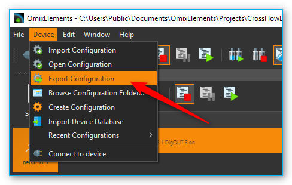

.. include:: include/colors.rst

.. role:: sg-yellow-bg
.. role:: sg-green-bg  
.. role:: sg-blue-bg
.. role:: sg-pink-bg

CETONI Elements Software
========================

Lowering Log-Interval of CSV and Graphical Logger
-------------------------------------------------

The minimum value of the log interval in CETONI Elements is limited to 0.1
seconds. Because Windows is not a realtime operating system, there is
always jitter when doing things in certain intervals. That means, when
the log interval is set to 0.1 seconds it may be up to 0.11 or down to
0.09 seconds. So there is a jitter of ca. ± 10 ms. 

The lower the log
interval, the higher is the impact of this jitter on the precision of
the recorded values. That means for a log interval of 0.1 seconds the
jitter of ±- 10 ms will cause a deviation of 10%. 

For a log interval of
0.01 seconds the jitter may cause a deviation of 100% - that means the
interval of the recorded values reaches from 0.005 to 0.02 seconds.
Therefore we decided to limit the log interval to a reasonable value of
0.1 seconds.

.. image:: media/image50.png

To lower the minimum log interval of the CSV and graphical logger, you
need to edit the current active device configuration. 

.. rst-class:: steps

#. To do this, select
   :guilabel:`Device --> Browse Configuration Folder` from the application main menu.

   .. admonition:: Attention
      :class: caution

      It is not recommended to lower the interval      
      below 0.01 seconds because the timestamps of the recorded   
      values will not match the real timestamps and because the   
      precision of the recorded timestamps is too low.     

   .. image:: media/image51.png

#. This will open the device configuration folder in the Windows file
   explorer. Then open the file :file:`datalogger.xml` in a text editor or XML
   editor.

   .. image:: media/image52.png

#. Now change the :guilabel:`SampleTimeSecs Min` value to the required minimum
   logging interval. Restart the CETONI Elements software and open the
   logger configuration – now you can lower the logging interval to the
   value entered in the :file:`datalogger.xml` file.

   .. admonition:: Attention
      :class: caution

      Logging intervals below 0.01 seconds may cause   
      high CPU load and may have a negative impact on other       
      CETONI Elements functions.    

Edit Device Parameters
----------------------

You can edit device parameters directly in the CETONI Elements software
using the **CANopen Tools Plugin**. Read the `CANopen Tools Plugin documentation
<https://cetoni-software.github.io/cetoni_elements_doc/manual_en/canopentools_EN/canopentools_EN.html>`_
for detailed instructions how to use it.

.. admonition:: Attention
   :class: caution

   Changing device parameters can cause             
   malfunctions or cancel safety mechanisms. Only change       
   device parameters as instructed by the technical support    
   staff.    

Export Device Configuration
---------------------------

If you need to export the device configuration so send it to CETONI
support, please select the menu item :menuselection:`Device --> Export Configuration`
from the application main menu.

Export Project
--------------

Currently CETONI Elements does not support the automatic export of complete
projects. If you need to send a complete project including all settings
to the CETONI support, you need to execute the following steps.

.. rst-class:: steps

#. Select the menu item :menuselection:`File --> Browse Project Folder` to open the project
   folder of the current project in file explorer.

   .. image:: media/image58.png

#. The file explorer will open the project folder and show you the project
   files. Navigate to the parent directory of the project folder by
   clicking the parent directory name (figure below).

   .. image:: media/image59.png

#. If you are in the parent folder, you can see the project folder of you
   current project:

   .. image:: media/image60.png

#. Press and hold (or right-click) the project folder, select (or point to)
   :guilabel:`Send to`, and then select :guilabel:`Compressed (zipped) folder`. A new
   zipped folder with the same name is created in the same location that
   you can send to CETONI support.

Send Log-Files
--------------

The CETONI Elements log files are located in
:code:`c:\Users\Public\Documents\CETONI Elements\Log``. The main application log
file is CETONI Elements.log.

.. image:: media/image61.png

In case the CETONI support requests the log files, you can send the
:file:`QmixEleemnts.log` file or you can send the compressed Log folder. To
send the compressed Log folder, navigate to the
:code:`c:\Users\Public\Documents\CETONI Elements` directory. Press and hold (or
right-click) the :guilabel:`Log` folder, select (or point to) :guilabel:`Send to`, and
then select :guilabel:`Compressed (zipped) folder`. A new zipped folder with the
same name is created in the same location that you can send to CETONI
support.

Change PDO Inhibit Time
--------------------------

The PDO inhibit time is the time a device waits before sending a PDO if the
value of the PDO has changed. The CETONI devices are delivered with default
PDO inhibit times. If you need to change the PDO inhibit time, i.e. if you 
would like sample the data more often, you can do this with the CANopen Tools
Plugin. Read the `CANopen Tools Plugin documentation <https://cetoni-software.github.io/cetoni_elements_doc/manual_en/canopentools_EN/canopentools_EN.html>`_
to learn how to open the CANopen Tools Workspace.

.. admonition:: Attention
   :class: caution

   Changing the PDO inhibit time can cause             
   malfunctions or cancel safety mechanisms. Only change       
   the PDO inhibit time as instructed by the technical support    
   staff.

.. admonition:: Important
   :class: note

   Backup your device parameters via :menuselection:`Export DCF file` before
   changing any parameters. This will allow you to restore the original configuration
   if something goes wrong or if you accidentally change a parameter that you did not
   want to change.

To change the PDO inhibit time, do the following steps after you have opened the
CANopen Tools Workspace:

.. rst-class:: steps

#. Connect to the device by clicking the :guilabel:`Connect` button in the main toolbar.

   .. image:: media/pdo_inhibit_connect.png

#. Scan for the device by clicking the :guilabel:`Scan Network` button in the
   CANopen Tools toolbar.

   .. image:: media/pdo_inhibit_scan.png

#. Assign an EDS file to the node that you would like to change. right-click on the
   node and select :menuselection:`Assign EDS File`. Select the EDS file that
   matches your device.

   .. image:: media/pdo_inhibit_assign_eds.png

#. Open the Transmit PDO parameters for the PDO that you would like to change.
   Normally the relevant object dictionary entries are **0x1800, 0x1801, 0x1802 and 
   0x1803**.

   .. image:: media/pdo_inhibit_objdic_index.png

#. Change the inhibit time to the desired value. The inhibit time is given in
   100 µs units. For example, if you would like to change the inhibit time to
   10 ms you need to enter 100 in the inhibit time field.

#. Save the parameters - right click on the node and select :menuselection:`Node: Store Parameters`.

   .. image:: media/pdo_inhibit_store_param.png