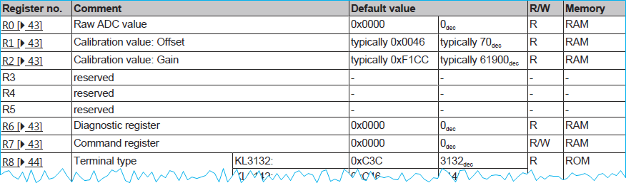
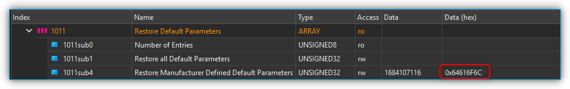
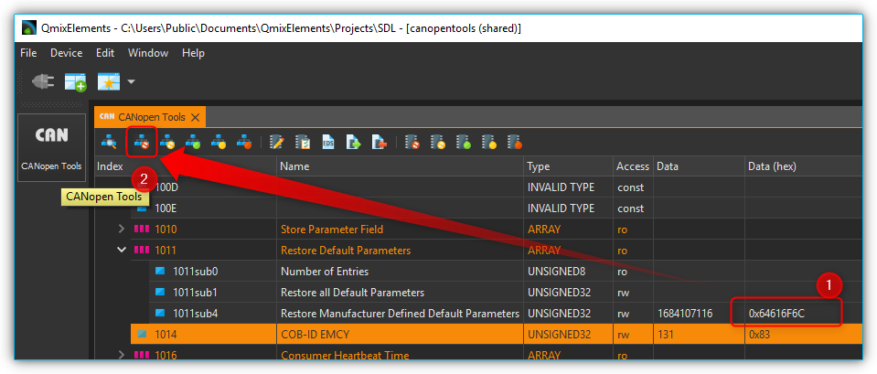
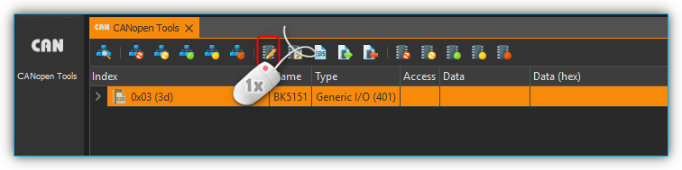

.. include:: include/colors.rst

.. role:: sg-yellow-bg
.. role:: sg-green-bg  
.. role:: sg-blue-bg
.. role:: sg-pink-bg

Qmix I/O-B Module
=================

Configuring a bus terminal
--------------------------

Overview
~~~~~~~~

The QmixIO-B module is equipped with a series of bus terminals with
different functions, depending on the configuration. Each individual bus
terminal contains a set of registers for configuration or for reading
status information. These registers are numbered starting at 0 and can
therefore be easily addressed via the index. The following picture shows
the register overview of the KL3162 analog input terminal.

.. tip::
   To obtain an overview and description of all registers for a specific
   terminal, simply download the documentation for the terminal from
   Beckhoff.

Device parameter access
~~~~~~~~~~~~~~~~~~~~~~~

To access and configure a certain bus terminal you can use the
QmixElements CANopenTools Plugin.

.. rst-class:: steps

#. To open the CANopenTools Plugin, start
   the QmixElements software and select from the main menu the menu item
   :menuselection:`Device --> Open Configuration`.

   .. image:: media/image62.png

#. Then select the canopentools configuration:

   .. image:: media/image63.png

#. Connect your QmixIO-B module or your Beckhoff bus coupler with your PC
   and turn it **on**. Then click the :guilabel:`Connect` :guinum:`❶` button in the QmixElements
   software and scan for connected devices :guinum:`❷`.

   .. image:: media/image64.png

#. The software should detect the connected module :guinum:`❶`. Click with the right
   mouse button on the entry with the detected device and select :file:`Assign EDS File` 
   :guinum:`❷` (see figure below).

   .. image:: media/image65.png

#. Select the valid EDS file for the Beckhoff BK5151 bus coupler from the
   existing EDS-files.

   .. image:: media/image69.png

#. Now navigate to the object dictionary entry **0x4501– Register
   Communication Bus Terminal**. Select the sub entry (0x4501subx) that
   matches the channel of your bus terminal that you want to configure. 
   
   The bus terminals are numbered in the order they are attached to the bus
   coupler. I.e. if you have two terminals and the first terminal is an
   analog input terminal and the second terminal is a thermocouple
   terminal, then the object dictionary entry would be 0x4501sub2 –
   Register Communication Bus Terminal 2 for the configuration of the
   thermocouple bus terminal.

.. image:: media/image70.png

Register access
~~~~~~~~~~~~~~~

Register values are read and written via the corresponding object
dictionary entry for the terminal **0x4501subX** where "X" is the index of the
terminal. The register is accessed by reading and writing a 32-bit
value. The following table shows the bits of this 32–bit value:

.. list-table::
   :widths: 15 20 20 15 15 
   :header-rows: 1

   * - 31
     - 30 - 24
     - 23 - 16
     - 15 - 9
     - 7 - 0
   * - :sg-yellow-bg:`Access bit`
     - :sg-green-bg:`Channel number`
     - :sg-blue-bg:`Register number`
     - :sg-pink-bg:`High byte register value`
     - :sg-pink-bg:`Low byte register value`
   * - MSB 
     - 
     - 
     - 
     - LSB

-  :sg-yellow-bg:`Access bit:` 0 = read access, 1 = write access

-  :sg-green-bg:`Channel number:` If a bus terminal has multiple channels, like the
   Kl3162 bus terminal with 2 analog input channels, this channel number
   addresses the corresponding channel of the terminal. Channel number 0
   corresponds here to the first channel, 1 to the second channel, and
   so forth.

-  :sg-blue-bg:`Register number:` The register that should be accessed. Read the bus
   terminal documentation for a register overview.

-  :sg-pink-bg:`Register value:` The 16-bit register value consists of high and low
   byte.

Reading register values
~~~~~~~~~~~~~~~~~~~~~~~

To read a register value, you first need to write to object **0x4501subX**
to identify the channel and the register and then you can read the
register value from the same object. So each read consists of a write
access followed by a read access from the same object.

The following example shows how to read a parameter. For this example,
we assume that we want to read the calibration interval (register 40)
from the second channel of the KL3162 analog input terminal.

.. rst-class:: steps

#. This terminal is the 1\ :sup:`st` terminal on our QmixIO-B module so we need
   to access the object dictionary entry **0x4501sub1**.

#. To read the calibration offset value, we first need to write the
   following value:

   -  Access bit :sg-yellow-bg:`0` = read access

   -  Channel number :sg-green-bg:`1` (0 = first channel, **1 = second channel** …)

   -  Register index 40 (Calibration interval) hexadecimal :sg-blue-bg:`28`

   -  Register value :sg-pink-bg:`0`

   So we have the following value that we need to write: 0x\ :sg-yellow-bg:`0`\ :sg-green-bg:`1`\ :sg-blue-bg:`28`\ :sg-pink-bg:`0000`

   .. image:: media/image71.png

#. To see the value that has been read from device, you need to click on
   another object :guinum:`❶`, e.g. 4501sub0 and then click on the index *0x4501sub1*
   again :guinum:`❷`. This will trigger a read of the object *4501sub1*.

   .. image:: media/image72.png

#. Now you can see the value read from the device. It is 
   :sg-yellow-bg:`0`\ :sg-green-bg:`1`\ :sg-blue-bg:`28`\ :sg-pink-bg:`0708`. 
   
So the
value read from the device contains the same configuration for Access
bit, channel number and register index, but the register value field has
been updated with the value read from device. The hexadecimal value of
708 corresponds to 1800 decimal. The calibration value is given in
multiple of 100 ms so the 1800 indicates a calibration interval of 180
seconds.

Writing register values
~~~~~~~~~~~~~~~~~~~~~~~

Before you can change any register value of a terminal channel, you need
to disable the write protection for the channel. In normal mode all user
registers are read-only with the exception of Register 31. In order to
deactivate this write protection you must write the code word (**0x1235**)
into Register 31. If a value other than 0x1235 is written into Register
31, write **protection is reactivated**. 

Please note that changes to a
register only become effective after restarting the terminal (power
off/power-on). So to deactivate write protection, the value 0x1\ **y**\ 1F1235
(**y** = Channel number) needs to be written first.

For the following example we want to change the calibration interval of
the first channel of a KL3162 dual channel analog output terminal to 300
seconds. The first step we need to do is to disable write protection for
the first channel. This terminal is the 1\ :sup:`st` terminal on our
QmixIO-B module so we need to access the object dictionary entry
0x4501sub\ **1**.

.. _removing_write_protection:

:step:`Step 1 - Removing Write Protection`

First we disable write protection by writing the codeword 1235 to the
register 31:

-  Access bit :sg-yellow-bg:`1` = **write access**

-  Channel number :sg-green-bg:`0` (**0 = first channel**, 1 = second channel …)

-  Register index 31 (Code word register) --> hexadecimal :sg-blue-bg:`1F`

-  Register value :sg-pink-bg:`1235`

So we write the following value to disable write protection: 
0x\ :sg-yellow-bg:`8`\ :sg-green-bg:`0`\ :sg-blue-bg:`1F`\ :sg-pink-bg:`1235`

.. image:: media/image73.png

:step:`Step 2 - Writing new Value`

Now we can change the calibration time:

-  Access bit :sg-yellow-bg:`1` = **write access**

-  Channel number :sg-green-bg:`0` (**0 = first channel**, 1 = second channel …)

-  Register index 40 (Calibration interval) --> hexadecimal :sg-blue-bg:`28`

-  Register value 300 seconds, the value is given in multiple of 100 ms,
   that means value is 3000 decimal --> hexadecimal :sg-pink-bg:`0BB8`

So we write the following value to change the calibration interval to
300 seconds: 0x\ :sg-yellow-bg:`8`\ :sg-green-bg:`0`\ :sg-blue-bg:`28`\ :sg-pink-bg:`0BB8`

:step:`Step 3 - Reading back written value`

Now we can verify the written value by reading the register value back.

-  Access bit :sg-yellow-bg:`0` = **read access**

-  Channel number :sg-green-bg:`0` (**0 = first channel**, 1 = second channel …)

-  Register index 40 (Calibration gain) --> hexadecimal :sg-blue-bg:`28`

-  Register value 300 seconds, the value is given in multiple of 100 ms,
   that means value is 3000 decimal --> hexadecimal :sg-pink-bg:`0000`

So we write the following value to read the calibration interval:
0x\ :sg-yellow-bg:`0`\ :sg-green-bg:`0`\ :sg-blue-bg:`28`\ :sg-pink-bg:`0000`

Click on another object dictionary entry and then on this entry
again, to force an update of the value read from device, like it is
written in the section `Reading register values`_.

.. _storing_data_peristently:

:step:`Step 4 - Storing data persistently`

If you have configured all channels properly, you can write the
configuration persistently into the non-volatile memory of the Beckhoff
device. Click with the right mouse button into the device entry :guinum:`❶` and
select :guilabel:`Node Store Parameters` from the context menu :guinum:`❷`.

.. image:: media/image74.png

KL316x - Analog input terminal 0…10 V
-------------------------------------

Configuring Auto Calibration
~~~~~~~~~~~~~~~~~~~~~~~~~~~~

To configure the KL316x terminal you can use the QmixElements
CANopenTools Plugin. Please read the section `Configuring a bus terminal`_ 
to learn how to read and write
registers of a bus terminal.

Sometimes the Auto Calibration of the KL316x analog input terminal may
fail or cause problems. You can prevent this by disabling auto
calibration and setting the interval for forced calibration to a very
long time. The following picture shows relevant registers of the bus
terminal (copied from manual).

.. image:: media/image75.png

.. admonition:: Important
   :class: note

   Before you can change any value, you need to disable write protection
   for the channel of the terminal. Read the section :ref:`Removing Write Protection<removing_write_protection>` 
   to learn how to disable the
   write protection for the registers of a single channel.

If write protection is removed, we can start writing other registers.

.. rst-class:: steps

#. First you can set the calibration interval (R40) to the maximum value
   0xFFFF decimal 65536. The value is given in multiple of 100 ms so this
   means calibration interval of 6553 seconds:

   -  Access bit :sg-yellow-bg:`1` = **write access**

   -  Channel number :sg-green-bg:`y` (**0 = first channel**, 1 = second channel …)

   -  Register index 40 (Calibration interval) --> hexadecimal :sg-blue-bg:`28`

   -  Register value maximum --> hexadecimal :sg-pink-bg:`FFFF`

#. Write value 0x\ :sg-yellow-bg:`8`\ :sg-green-bg:`y`\ :sg-blue-bg:`28`\ :sg-pink-bg:`FFFF`
   to object 0x4501subX and replace y with the
   channel number. You can now read the value back, to verify if it has
   been written properly by writing 0x\ :sg-yellow-bg:`0`\ :sg-green-bg:`y`\ :sg-blue-bg:`28`\ :sg-pink-bg:`0000`.

#. Now we also set the interval for forced calibration (R44) to a maximum
   value 0xFFFF:

   -  Access bit :sg-yellow-bg:`1` = **write access**

   -  Channel number :sg-green-bg:`y` (**0 = first channel**, 1 = second channel …)

   -  Register index 44 (Interval for forced calibration) --> hexadecimal :sg-blue-bg:`2C`

   -  Register value maximum --> hexadecimal :sg-pink-bg:`FFFF`

#. Write value 0x\ :sg-yellow-bg:`8`\ :sg-green-bg:`y`\ :sg-blue-bg:`2C`\ :sg-pink-bg:`FFFF`
   to object 0x4501subX and replace y with the
   channel number.

   .. image:: media/image76.png

   You can now read the value back, to verify if it has been written
   properly by writing 
   0x\ :sg-yellow-bg:`0`\ :sg-green-bg:`y`\ :sg-blue-bg:`28`\ :sg-pink-bg:`0000`.

#. Then you can disable auto calibration via the feature register R32.

   .. image:: media/image77.png

   .. tip::
      This register contains several configuration bits. Read the KL316x
      manual for a detailed description of the bits in the feature register.

   .. image:: media/image78.png

#. So we need to set Bit 5 of this register to 1 to disable. To ensure that
   no other bits are modified, you first need to read the register value
   from the device:

   -  Access bit :sg-yellow-bg:`0` = **read access**

   -  Channel number :sg-green-bg:`y` (**0 = first channel**, 1 = second channel …)

   -  Register index 32 (Calibration gain) hexadecimal :sg-blue-bg:`20`

   -  Register value :sg-pink-bg:`0000`

#. We write the following value to read the feature register: 
   0x\ :sg-yellow-bg:`0`\ :sg-green-bg:`0`\ :sg-blue-bg:`20`\ :sg-pink-bg:`0000`.

   Normally the device should return the default configuration value: 0.
   Now you can set bit 5 – that means the value to write will be the value
   read from device ored with 0x0020 (Bit 5 set).

   -  Access bit :sg-yellow-bg:`1` = **read access**

   -  Channel number :sg-green-bg:`y` (**0 = first channel**, 1 = second channel …)

   -  Register index 32 (Calibration gain) hexadecimal :sg-blue-bg:`20`

   -  Register value :sg-pink-bg:`0020`

#. Write value 0x\ :sg-yellow-bg:`8`\ :sg-green-bg:`y`\ :sg-blue-bg:`20`\ :sg-pink-bg:`0020`
   to object 0x4501subX and replace y with the
   channel number. You can now read the value back, to verify if it has
   been written properly by writing 
   0x\ :sg-yellow-bg:`0`\ :sg-green-bg:`y`\ :sg-blue-bg:`20`\ :sg-pink-bg:`0000`.

#. If you have configured all channels properly, you can write the
   configuration persistently into the non-volatile memory of the Beckhoff
   device like written in section :ref:`Storing data persistently<storing_data_peristently>`.

KL320x – PT100 (RTD) Terminal
-----------------------------

Configuring Sensor Type
~~~~~~~~~~~~~~~~~~~~~~~

To configure the thermocouple type of a KL320x terminal you can use the
QmixElements CANopenTools Plugin. Please read the section `Configuring a
bus terminal`_ to learn how to read and
write registers of a bus terminal.

.. rst-class:: steps

#. You can select the sensor type via the feature register (**32**) of the
   KL320x bus terminal. Here is a snippet from the KL320x manual that shows
   the register **R32**. You can select the type via bits 12-15.

   .. list-table::
      :widths: 10 10 50
      :header-rows: 1

      * - **Feature bit no.**
        -
        - **Description of the operating mode**  
      * - Bit 0
        - 1
        - User scaling (R33, R44) active [0] 
      * - Bit 1
        - 1
        - Manufacturer scaling (R19, R20) active [1]
      * - Bit 2
        - 1
        - Watchdog timer active [1] 
   
          (In the delivery state, the watchdog timer is switched on.)   
      * - Bit 3 
        - 1
        - Sign / amount representation [0]    

          (Sign / amount representation is active instead of two's- complement representation (-1 = 0x8001). )        
      * - Bit 4 
        - 1
        - Siemens output format [0] 
   
          (This bit is used for inserting status information on the lowest 3 bits (see below). )
      * - Bit 5, 6 
        - /
        - reserved, do not change. 
      * - Bit 7 
        - 1
        - Activates filter constant in R37 [0]  
      * - Bit 8 
        - 1
        - Over range Protection [1]  

          (If the temperature exceeds 850°C the status bits are correspondingly set and the output value is 850°C. )
      * - Bit 9
        - /
        - reserved, do not change  
      * - Bit 10
        - 1
        - Two-wire connection [0]   
      * - Bit 11
        - /
        - reserved, do not change   
      * - Bit 15, 14, 13, 12
        - Element
        - Valid measuring range 
      * - 
        - 
        - 
      * - 0000
        - **PT100**
        - -200°C to 850°C  
      * - 0001
        - **NI100**
        - -60°C to 250°C 
      * - 0010
        - **PT1000**
        - -200°C to 850°C  
      * - 0011
        - **PT500**
        - -200°C to 850°C   
      * - 0100
        - **PT200**
        - -200° C to 850°C 
      * - 0101
        - **NI1000**
        - -200°C to 850°C 
      * - 0110
        - **NI120**
        - -80°C to 320°C   
      * - 1110
        - **Output in Ω**
        - 10.0 Ω to 5000.0 Ω 
      * - 1111
        - **Output in Ω**
        - 10.0 Ω to 1200.0 Ω  

   When writing data to the terminal or reading data to the terminal, the
   register value of the feature register is mapped into the lower 16 bits
   of the 32 bit message value:

   .. list-table::
      :widths: 10 15 15 20 20
      :header-rows: 1

      * - 31
        - 30 - 24
        - 23 - 16
        - 15 - 12
        - 11 - 0
      * - :sg-yellow-bg:`Access bit`
        - :sg-green-bg:`Channel number`
        - :sg-blue-bg:`0x20 (decimal 32)`
        - :sg-pink-bg:`Feature register value - Sensor Type`
        - :sg-pink-bg:`Feature register value - Other Feature Bits`
      * - MSB
        - 
        - 
        - 
        - LSB

#. Now navigate to the object dictionary entry **0x4501– Register Communication Bus Terminal**. 
   Select the sub entry (**0x4501subX**) that
   matches the channel of your thermocouple terminal. I.e. if you have two
   terminals and the first terminal is an analog input terminal and the
   second terminal is your thermocouple terminal, then the object
   dictionary entry would be 0x4501sub2 – Register Communication Bus
   Terminal 2.

   .. image:: media/image70.png

#. Before you can change any register value of a terminal channel, you need
   to disable the write protection for the channel. Read section :ref:`Removing Write Protection<removing_write_protection>` 
   to learn how to disable
   the write protection.

   To disable write protection for a channel, write 
   0x\ :sg-yellow-bg:`8`\ :sg-green-bg:`y`\ :sg-blue-bg:`1F`\ :sg-pink-bg:`1235` 
   to the channel. Replace the y with the channel number. If you would like to
   change the first channel (channel :sg-green-bg:`0`) then write 
   0x\ :sg-yellow-bg:`8`\ :sg-green-bg:`0`\ :sg-blue-bg:`1F`\ :sg-pink-bg:`1235`
   to the terminal register.

   .. image:: media/image73.png

#. Now you can write the RTD sensor type to the terminal. Use the values
   from the feature register table above. Replace :sg-green-bg:`y` with the channel
   number. Please note, that writing the feature register may change other
   bits in the feature register:

   -  PT100 – 0x\ :sg-yellow-bg:`8`\ :sg-green-bg:`y`\ :sg-blue-bg:`20`\ :sg-pink-bg:`0106`

   -  PT1000 – 0x\ :sg-yellow-bg:`8`\ :sg-green-bg:`y`\ :sg-blue-bg:`20`\ :sg-pink-bg:`1106`

   To configure the PT100 sensor for channel :sg-green-bg:`0` write 
   0x\ :sg-yellow-bg:`8`\ :sg-green-bg:`0`\ :sg-blue-bg:`20`\ :sg-pink-bg:`0106`
   to the terminal.

   .. image:: media/image79.png

#. Now you can verify that the thermocouple has been configured properly,
   by reading back the configured register value. To do this, first write
   0x\ :sg-yellow-bg:`0`\ :sg-green-bg:`y`\ :sg-blue-bg:`20`\ :sg-pink-bg:`0000`
   to the terminal. (e.g. 0x\ :sg-yellow-bg:`0`\ :sg-green-bg:`0`\ :sg-blue-bg:`20`\ :sg-pink-bg:`0000`
   for channel :sg-green-bg:`0`).

   .. image:: media/image80.png

#. Then click on sub index 0 and then on the sub index of the terminal, to
   update the value.

   .. image:: media/image81.png

#. If you have configured all channels properly, you can write the
   configuration persistently into the non-volatile memory of the Beckhoff
   device like written in section :ref:`Storing data persistently<storing_data_peristently>`.

KL331x - Thermocouple Terminal
------------------------------

Configuring Thermocouple Type
~~~~~~~~~~~~~~~~~~~~~~~~~~~~~

To configure the thermocouple type of a KL331x terminal you can use the
QmixElements CANopenTools Plugin. Please read the section `Configuring a
bus terminal`_ to learn how to read and
write registers of a bus terminal.

You can select the thermoelement type via the feature register (32) of
the KL331x bus terminal. Here is a snippet from the KL331x manual that
shows the register R32. You can select the type via bits 12-15.

.. image:: media/image82.png

.. rst-class:: steps

#. When writing data to the terminal or reading data to the terminal, the
   register value of the feature register is mapped into the lower 16 bits
   of the 32 bit message value:

   .. list-table::
      :widths: 10 15 15 20 20
      :header-rows: 1

      * - 31
        - 30 - 24
        - 23 - 16
        - 15 - 12
        - 11 - 0
      * - :sg-yellow-bg:`Access bit`
        - :sg-green-bg:`Channel number`
        - :sg-blue-bg:`0x20 (decimal 32)`
        - :sg-pink-bg:`Feature register value - Sensor Type`
        - :sg-pink-bg:`Feature register value - Other Feature Bits``
      * - MSB
        - 
        - 
        - 
        - LSB

#. Now navigate to the object dictionary entry **0x4501– Register
   Communication Bus Terminal**. Select the sub entry (0x4501subX) that
   matches the channel of your thermocouple terminal. I.e. if you have two
   terminals and the first terminal is an analog input terminal and the
   second terminal is your thermocouple terminal, then the object
   dictionary entry would be 0x4501sub2 – Register Communication Bus
   Terminal 2.

   .. image:: media/image70.png

#. Before you can change any register value of a terminal channel, you need
   to disable the write protection for the channel. Read section :ref:`Removing Write Protection<removing_write_protection>` 
   to learn how to disable
   the write protection.

   To disable write protection for a channel, write 0x\ :sg-yellow-bg:`8`\ :sg-green-bg:`y`\ :sg-blue-bg:`F1`\ :sg-pink-bg:`1235`
   to the channel. Replace the :sg-green-bg:`y` with the channel number. If you would like to
   change the first channel (channel :sg-green-bg:`0`) then write 
   0x\ :sg-yellow-bg:`8`\ :sg-green-bg:`0`\ :sg-blue-bg:`F1`\ :sg-pink-bg:`1235` 
   to the terminal register.

   .. image:: media/image73.png

#. Now you can write the thermocouple type to the terminal. Use the
   following values for the different types:

   -  Typ K – 0x\ :sg-yellow-bg:`8`\ :sg-green-bg:`y`\ :sg-blue-bg:`20`\ :sg-pink-bg:`1026`

   -  Typ J – 0x\ :sg-yellow-bg:`8`\ :sg-green-bg:`y`\ :sg-blue-bg:`20`\ :sg-pink-bg:`2026`

   To configure the :sg-pink-bg:`Typ K` thermocouple for channel :sg-green-bg:`0` 
   then write 0x\ :sg-yellow-bg:`8`\ :sg-green-bg:`0`\ :sg-blue-bg:`20`\ :sg-pink-bg:`1026`
   to the terminal.

   .. image:: media/image83.png

#. Now you can verify that the thermocouple has been configured properly,
   by reading back the configured register value. To do this, first write
   0x\ :sg-yellow-bg:`0`\ :sg-green-bg:`y`\ :sg-blue-bg:`20`\ :sg-pink-bg:`0000` 
   to the terminal. (e.g. 0x\ :sg-yellow-bg:`0`\ :sg-green-bg:`0`\ :sg-blue-bg:`20`\ :sg-pink-bg:`0000` 
   for channel :sg-green-bg:`0`).

   .. image:: media/image80.png

#. Then click on sub index 0 and then on the sub index of the terminal, to
   update the value.

   .. image:: media/image84.png

#. If you have configured all channels properly, you can write the
   configuration persistently into the non-volatile memory of the Beckhoff
   device like written in section :ref:`Storing data persistently<storing_data_peristently>`.

Adding Terminals
----------------

   Before you start, please contact the application and sales team of
   CETONI and tell them which device you are going to update (CET-number)
   and which terminals you are going to add to your Qmix-I/O-B. CETONI will
   send you an updated device database which you have to import into your
   QmixElements software or, if necessary, an updated software version if
   the terminals are not supported by QmixElements at the moment. After you
   have imported the updated device database or reinstalled the software,
   please perform the following instructions.

:step:`Step 1 - Preparations`

Please add your Qmix-I/O-B module only to your Qmix system and check
that your device is switched off. Physically add your new terminals to
your Qmix-I/O-B. Terminate the Qmix-I/O-B with the Beckhoff KL 9010 end
terminal. Finally switch on your device.

.. admonition:: Attention
   :class: caution

   Do not forget to terminate your Qmix-I/O-B using 
   the KL 9010 bus end terminal. Otherwise the device will not 
   work.. 

:step:`Step 2 - Restore Factory Default Settings`

Factory default settings need to be restored in order to let the device
properly set up it’s communication parameters. Therefore in QmixElements
load the device configuration *canopentools*. Connect the software to
your Qmix system and scan for devices connected to your base module. A
generic I/O device should be displayed (see figure below).

Next please look for the object dictionary entry *1011 Restore default
parameters.* In sub-index 4 *Restore Manufacturer Defined Default
Parameters* please enter the value *0x64616F6C* in **Data (hex)**.
Subsequently please reset the device pressing the :guilabel:`All nodes: Reset`
button (please see figures below).

:step:`Step 3 - Adapt Inhibit Time and Save Parameters`

Now you need to set the inhibit time of all *Transmit
PDO Communication Parameter* entries for analog input devices. Starting
from object dictionary entry 1801 till 1803, please click the sub-index
1 *COB-ID* and check whether the first digit in **Data (hex)** is 8. If
it is not, in sub-index *3 Inhibit Time* please enter the value 1000 in
the **Data** field. If you have found a COB-ID carrying 8 as the first
digit in Data (hex), the communication parameter is deactivated. That
means you have successfully finished this step (please see figure
below).

.. admonition:: Important
   :class: note

   Object dictionary entry 1800 is reserved for     
   digital input channels. Please leave it’s configuration     
   untouched.     

.. image:: media/image88.png
   :alt: inhibit_time.png

Finally you’ll just have to save the configured parameters by pressing
the :guilabel:`Node: Store Parameters` button and accept the following question
for storing the parameters permanently to the device.(please see the
figure below).

You have finished adding the new terminals and should now be able to
create a new device configuration with your updated Qmix-I/O-B device
and use it within your application.