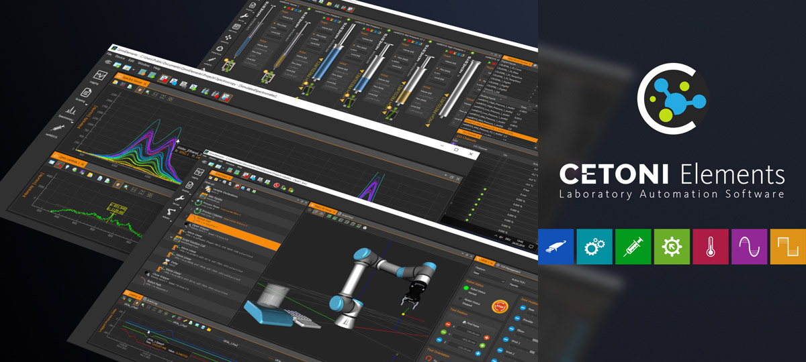

CETONI Elements Service Guide
=========================================

**Welcome to CETONI Elements documentation!**

With this service guide we want to support you as much as possible in handling 
the device service or failure cases. Please do not hesitate to contact us in 
case of any questions or suggestions.

Symbols and Signal Words Used
-----------------------------

The following symbols are used in this manual and are designed to aid
your navigation through this document:

.. tip::
   Describes practical tips and useful information to facilitate the handling 
   of the device.

.. admonition:: Important
   :class: note

   Describes important information and other especially useful notes, in which 
   no dangerous or damaging situations can arise.

.. admonition:: Attention
   :class: caution

   Identifies a potentially harmful situation. Failure to avert this situation 
   may result in damage to the product or anything in its proximity.

.. admonition:: Caution
   :class: error
  
   Indicates a potentially dangerous situation. Failure to avert this situation 
   may result in light or minor injuries or damages.

.. toctree::
   :maxdepth: 2
   :caption: Contents:
   :hidden:
   :numbered: 3

   Nemesys_Service_Tool.rst
   QmixElements_Software.rst
   Qmix_P_Q+_Q-_TC_and_V_Modules.rst
   Qmix_IO-B_Module.rst
   Nemesys_UserInterface.rst
   BASE120_BASE600_Firmware_Update.rst
